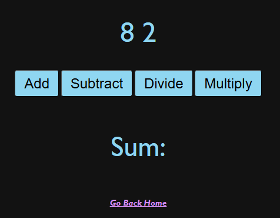
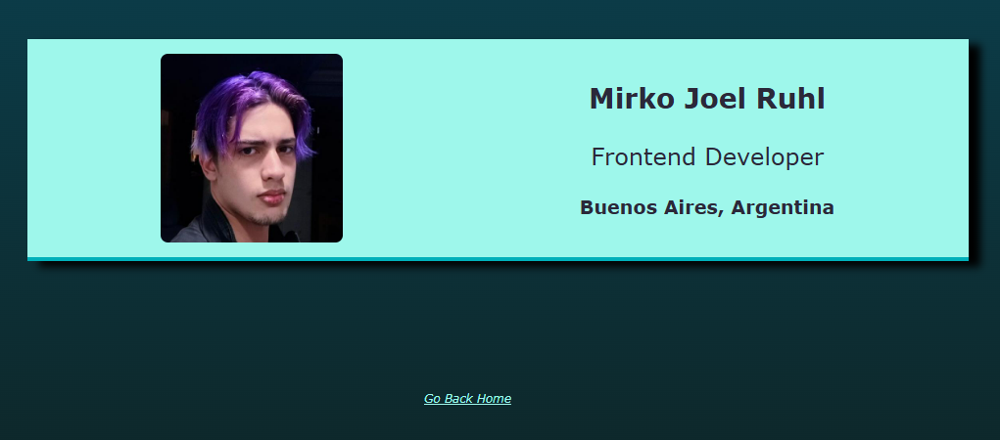
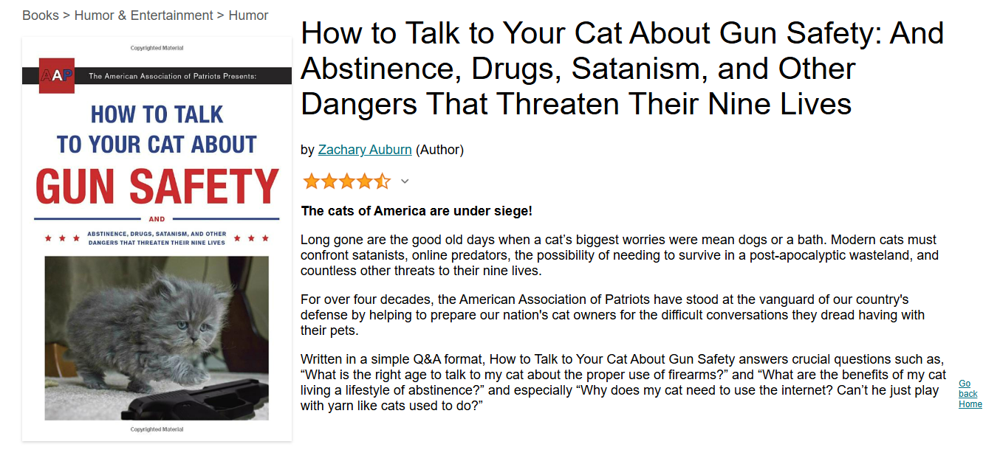
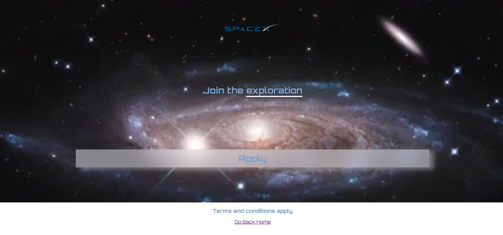
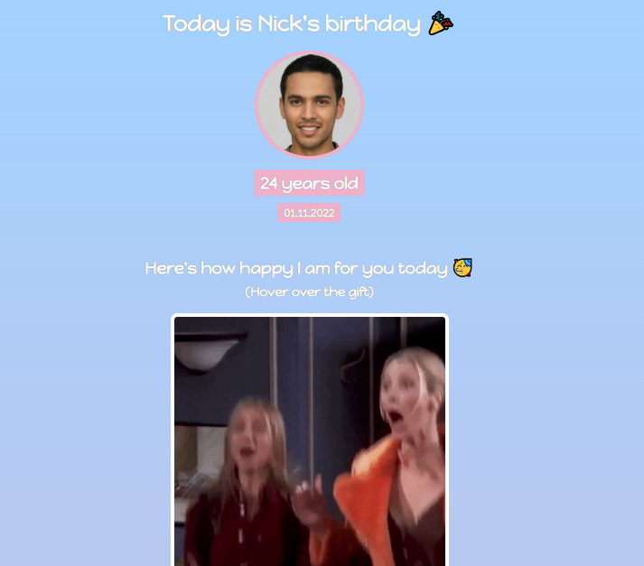
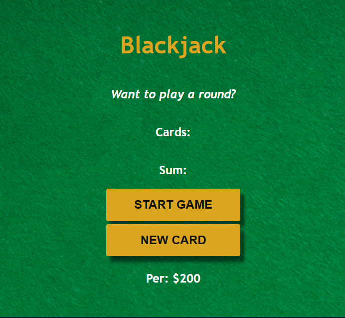

# Learning with Scrimba

This repo was made with the intent of archiving all my projects made with the scrimba website at [Scrimba](https://scrimba.com/).

## Front End Development

The path I'm currently archiving is of [FrontEnd development](https://scrimba.com/frontend-path-c0j).
So most pages are static pages made with HTML, CSS, Javascript and React.
 
Feel free to look around but most of the pages are copy-pasted version with litlle to no modification except for the Home Page.

## Projects

### Counter

This website is just a simple counter that can save values using mostly JavaScript.
 
 

### Calculator

This website a calculator that only takes two input but correctly makes each operation.
 
 

### Digital Bussiness Card

This website acts as a Bussiness Card, it displays basic information about myself.
 
 

### Amazon Book clone

This website is a clone of a book listing of Amazon, it's a copy pasted version of a single book, not a full on recreation of Amazon.
 
 

### SpaceX

This website was made to test how much I learned about CSS, it's just a presentation card.
 
 

### GIFts

This website was made to how to use mouse hover effects and using gifs on a website.
 
 

### BlackJack

In this website you play blackjack solo, you win by reaching exactly 21 points in cards, this website is a game of blackjack with no dealer to compete against.
 
 

