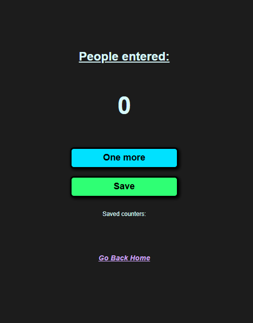

# Learning with Scrimba

This repo was made with the intent of archiving all my projects made with the scrimba website at [Scrimba](https://scrimba.com/).

## Front End Development

The path I'm currently archiving is of [FrontEnd development](https://scrimba.com/frontend-path-c0j).
So most pages are static pages made with HTML, CSS, Javascript and React.
 
Feel free to look around but most of the pages are copy-pasted version with litlle to no modification except for the Home Page.

## Projects

### Counter

This website is just a simple counter that can save values using mostly JavaScript.
 
 

###
